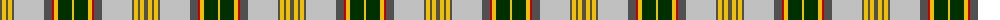

The parent of this is [Hutt Tartan](/tartans/na/4/y4/na2/y4/na2/n30/na8/r2/y4/dg14/y/2/)

This was sourced from weddslist.  It is a [11 stripes tartan](/stripes/stripes11/).

Original link http://www.weddslist.com/cgi-bin/tartans/pg.pl?source=sts

## Thread count
Na/4 Y4 Na2 Y4 Na2 N30 Na8 R2 Y4 DG14 Y/2

## Palette
Each colour and its ΔE from the base-6 reference it is a variant of.

| Colour | Shade | Base | ΔE (OKLab) |
|---|---|---|---|
| DG |  `#003000` | G  | 0.18 |
| N |  `#C0C0C0` | W  | 0.16 |
| Na |  `#505050` | B  | 0.12 |
| R |  `#C00000` | R  | 0.02 |
| Y |  `#F0C000` | Y  | 0.01 |

ID: /variants/na/4/y4/na2/y4/na2/n30/na8/r2/y4/dg14/y/2-dg003000-nc0c0c0-na505050-rc00000-yf0c000/
