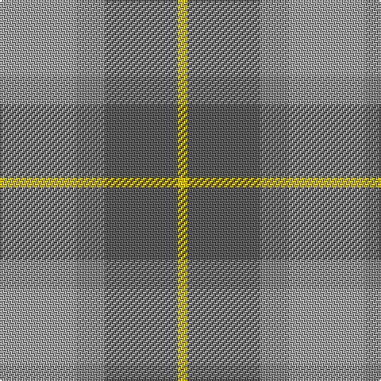

The parent of this is [Porcelanosa](/tartans/na/48/nb18/n46/y/6/)

This was sourced from register-of-tartans.  It is a [4 stripes tartan](/stripes/stripes4/).

Original link https://www.tartanregister.gov.uk/tartanDetails.aspx?ref=5426

## Thread count
Na/48 Nb18 N46 Y/6

## Palette
Each colour and its ΔE from the base-6 reference it is a variant of.

| Colour | Shade | Base | ΔE (OKLab) |
|---|---|---|---|
| N |  `#5C5C5C` | B  | 0.14 |
| Na |  `#A0A0A0` | Y  | 0.20 |
| Nb |  `#888888` | R  | 0.24 |
| Y |  `#E8C000` | Y  | 0.00 |

# Sample pattern

ID: /variants/na/48/nb18/n46/y/6-n5c5c5c-naa0a0a0-nb888888-ye8c000/
