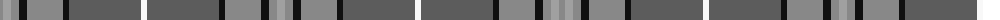

The parent of this is [Hebridean Granite](/tartans/na/6/nb8/na8/k8/na36/k6/n72/w6/n72/k6/na36/k8/na8/nb/8/)

This was sourced from register-of-tartans.  It is a [14 stripes tartan](/stripes/stripes14/).

Original link https://www.tartanregister.gov.uk/tartanDetails.aspx?ref=1653

## Thread count
Na/6 Nb8 Na8 K8 Na36 K6 N72 W6 N72 K6 Na36 K8 Na8 Nb/8

## Palette
Each colour and its ΔE from the base-6 reference it is a variant of.

| Colour | Shade | Base | ΔE (OKLab) |
|---|---|---|---|
| K |  `#101010` | K  | 0.17 |
| N |  `#5C5C5C` | B  | 0.14 |
| Na |  `#888888` | R  | 0.24 |
| Nb |  `#A0A0A0` | Y  | 0.20 |
| W |  `#F8F8F8` | W  | 0.01 |

ID: /variants/na/6/nb8/na8/k8/na36/k6/n72/w6/n72/k6/na36/k8/na8/nb/8-k101010-n5c5c5c-na888888-nba0a0a0-wf8f8f8/
