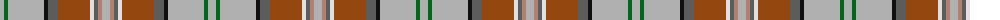

The parent of this is [Australian Heavy Horse (Corporate)](/tartans/na/8/g4/na36/k4/n10/t32/ln4/n4/lt4/na/8/)

This was sourced from tartans-authority.  It is a [10 stripes tartan](/stripes/stripes10/).

Original link http://www.tartansauthority.com/tartan-ferret/display/10136/

## Thread count
Na/8 G4 Na36 K4 N10 T32 LN4 N4 LT4 Na/8

## Palette
Each colour and its ΔE from the base-6 reference it is a variant of.

| Colour | Shade | Base | ΔE (OKLab) |
|---|---|---|---|
| G |  `#006818` | G  | 0.02 |
| K |  `#101010` | K  | 0.17 |
| LN |  `#E0E0E0` | W  | 0.06 |
| LT |  `#B08070` | R  | 0.19 |
| N |  `#5C5C5C` | B  | 0.14 |
| Na |  `#B0B0B0` | Y  | 0.18 |
| T |  `#944810` | R  | 0.12 |

ID: /variants/na/8/g4/na36/k4/n10/t32/ln4/n4/lt4/na/8-g006818-k101010-lne0e0e0-ltb08070-n5c5c5c-nab0b0b0-t944810/
