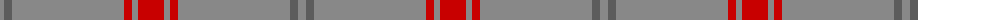
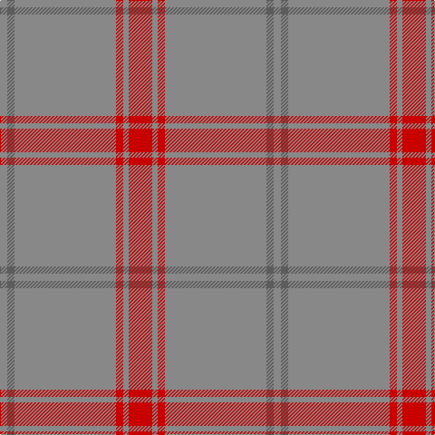

The parent of this is [Auchairne, Grey (Corporate)](/tartans/na/8/n8/na112/r8/na6/r/26/)

This was sourced from tartans-authority.  It is a [6 stripes tartan](/stripes/stripes6/).

Original link http://www.tartansauthority.com/tartan-ferret/display/2479/

## Thread count
Na/8 N8 Na112 R8 Na6 R/26

## Palette
Each colour and its ΔE from the base-6 reference it is a variant of.

| Colour | Shade | Base | ΔE (OKLab) |
|---|---|---|---|
| N |  `#5C5C5C` | B  | 0.14 |
| Na |  `#888888` | R  | 0.24 |
| R |  `#C80000` | R  | 0.00 |

# Sample pattern

ID: /variants/na/8/n8/na112/r8/na6/r/26-n5c5c5c-na888888-rc80000/
