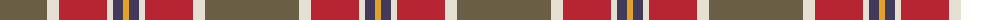

The parent of this is [Duminiak (Trevose, Pennsylvania)](/tartans/na/94/w12/r48/w6/n10/y/6/)

This was sourced from register-of-tartans.  It is a [6 stripes tartan](/stripes/stripes6/).

Original link https://www.tartanregister.gov.uk/tartanDetails.aspx?ref=10597

## Thread count
Na/94 W12 R48 W6 N10 Y/6

## Palette
Each colour and its ΔE from the base-6 reference it is a variant of.

| Colour | Shade | Base | ΔE (OKLab) |
|---|---|---|---|
| N |  `#433A5A` | B  | 0.08 |
| Na |  `#6A5E47` | G  | 0.14 |
| R |  `#B62531` | R  | 0.04 |
| W |  `#E5E0D2` | W  | 0.06 |
| Y |  `#E0A126` | Y  | 0.08 |

# Sample pattern

ID: /variants/na/94/w12/r48/w6/n10/y/6-n433a5a-na6a5e47-rb62531-we5e0d2-ye0a126/
