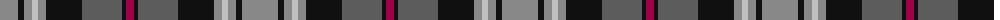

The parent of this is [Heart of the Highlands](/tartans/nb/36/k6/nb8/n6/nb8/k36/na40/k4/r/8/)

This was sourced from tartans-authority.  It is a [9 stripes tartan](/stripes/stripes9/).

Original link http://www.tartansauthority.com/tartan-ferret/display/11275/

## Thread count
Nb/36 K6 Nb8 N6 Nb8 K36 Na40 K4 R/8

## Palette
Each colour and its ΔE from the base-6 reference it is a variant of.

| Colour | Shade | Base | ΔE (OKLab) |
|---|---|---|---|
| K |  `#101010` | K  | 0.17 |
| N |  `#C0C0C0` | W  | 0.16 |
| Na |  `#5C5C5C` | B  | 0.14 |
| Nb |  `#888888` | R  | 0.24 |
| R |  `#A00048` | R  | 0.11 |

ID: /variants/nb/36/k6/nb8/n6/nb8/k36/na40/k4/r/8-k101010-nc0c0c0-na5c5c5c-nb888888-ra00048/
