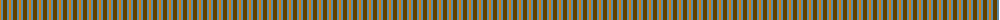
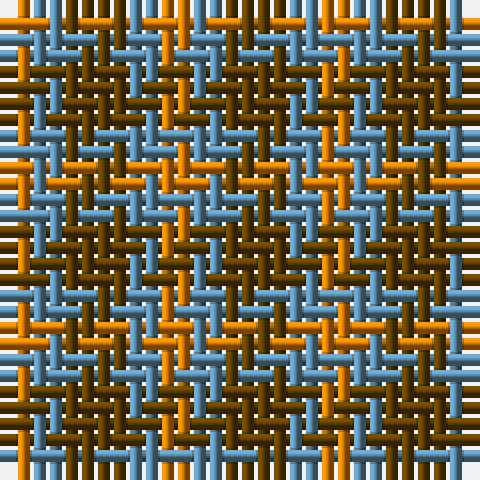

The parent of this is [Gearach Woodcock Tweed (Corporate)](/tartans/o/2/b2/t/4/)

This was sourced from tartans-authority.  It is a [3 stripes tartan](/stripes/stripes3/).

Original link http://www.tartansauthority.com/tartan-ferret/display/7466/

## Thread count
O/2 B2 T/4

## Palette
Each colour and its ΔE from the base-6 reference it is a variant of.

| Colour | Shade | Base | ΔE (OKLab) |
|---|---|---|---|
| B |  `#5C8CA8` | B  | 0.23 |
| O |  `#D87C00` | Y  | 0.17 |
| T |  `#604000` | G  | 0.14 |

# Sample pattern

ID: /variants/o/2/b2/t/4-b5c8ca8-od87c00-t604000/
