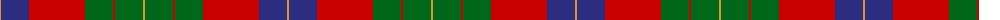

The parent of this is [Abernethy (Colerain USA) (Personal)](/tartans/o/2/db28/r56/g28/r2/g28/o/2/)

This was sourced from tartans-authority.  It is a [7 stripes tartan](/stripes/stripes7/).

Original link http://www.tartansauthority.com/tartan-ferret/display/10333/

## Thread count
O/2 DB28 R56 G28 R2 G28 O/2

## Palette
Each colour and its ΔE from the base-6 reference it is a variant of.

| Colour | Shade | Base | ΔE (OKLab) |
|---|---|---|---|
| DB |  `#2C2C80` | B  | 0.05 |
| G |  `#006818` | G  | 0.02 |
| O |  `#DC943C` | Y  | 0.12 |
| R |  `#C80000` | R  | 0.00 |

# Sample pattern

ID: /variants/o/2/db28/r56/g28/r2/g28/o/2-db2c2c80-g006818-odc943c-rc80000/
