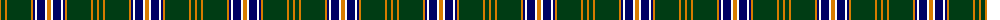

The parent of this is [Henry, David G (Personal)](/tartans/o/2/dg4/o2/dg24/o2/db2/w2/db8/w2/o/4/)

This was sourced from register-of-tartans.  It is a [10 stripes tartan](/stripes/stripes10/).

Original link https://www.tartanregister.gov.uk/tartanDetails.aspx?ref=11600

## Thread count
O/2 DG4 O2 DG24 O2 DB2 W2 DB8 W2 O/4

## Palette
Each colour and its ΔE from the base-6 reference it is a variant of.

| Colour | Shade | Base | ΔE (OKLab) |
|---|---|---|---|
| DB |  `#000064` | B  | 0.17 |
| DG |  `#003C14` | G  | 0.14 |
| O |  `#D87C00` | Y  | 0.17 |
| W |  `#FFFFFF` | W  | 0.03 |

ID: /variants/o/2/dg4/o2/dg24/o2/db2/w2/db8/w2/o/4-db000064-dg003c14-od87c00-wffffff/
