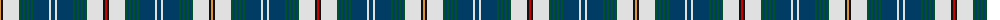

The parent of this is [Recovery Dress (Corporate)](/tartans/o/2/k2/ln16/g2/db2/g2/db2/g2/db2/g2/db16/ln2/db4/ln2/db16/g2/db2/g2/db2/g2/db2/g2/ln16/k2/r/2/)

This was sourced from tartans-authority.  It is a [25 stripes tartan](/stripes/stripes25/).

Original link http://www.tartansauthority.com/tartan-ferret/display/2441/

## Thread count
O/2 K2 LN16 G2 DB2 G2 DB2 G2 DB2 G2 DB16 LN2 DB4 LN2 DB16 G2 DB2 G2 DB2 G2 DB2 G2 LN16 K2 R/2

## Palette
Each colour and its ΔE from the base-6 reference it is a variant of.

| Colour | Shade | Base | ΔE (OKLab) |
|---|---|---|---|
| DB |  `#003C64` | B  | 0.07 |
| G |  `#00502C` | G  | 0.08 |
| K |  `#101010` | K  | 0.17 |
| LN |  `#E0E0E0` | W  | 0.06 |
| O |  `#DC943C` | Y  | 0.12 |
| R |  `#C80000` | R  | 0.00 |

ID: /variants/o/2/k2/ln16/g2/db2/g2/db2/g2/db2/g2/db16/ln2/db4/ln2/db16/g2/db2/g2/db2/g2/db2/g2/ln16/k2/r/2-db003c64-g00502c-k101010-lne0e0e0-odc943c-rc80000/
