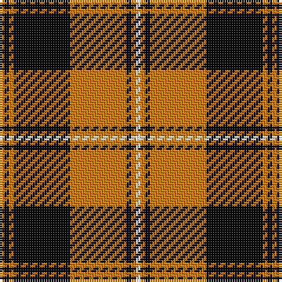

The parent of this is [Johnston Orange/Black (Corporate)](/tartans/o/2/k2/o2/k24/o24/k2/o2/w/2/)

This was sourced from tartans-authority.  It is a [8 stripes tartan](/stripes/stripes8/).

Original link http://www.tartansauthority.com/tartan-ferret/display/5307/

## Thread count
O/2 K2 O2 K24 O24 K2 O2 W/2

## Palette
Each colour and its ΔE from the base-6 reference it is a variant of.

| Colour | Shade | Base | ΔE (OKLab) |
|---|---|---|---|
| K |  `#000000` | K  | 0.00 |
| O |  `#D87C00` | Y  | 0.17 |
| W |  `#FCFCFC` | W  | 0.03 |

# Sample pattern

ID: /variants/o/2/k2/o2/k24/o24/k2/o2/w/2-k000000-od87c00-wfcfcfc/
