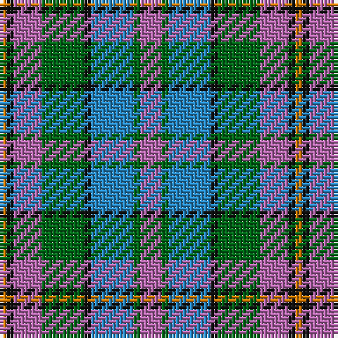

The parent of this is [Orkney District Tartan Tartan Number: 2301. Earliest known date: 2000 Orkney District tartan was designed for the Westry Knitters, on Orkney, by Ronnie Hek. Four designs were advertised in the window of a shop on Orkney's mainland and the most popular was chosen as the official Orcadian tartan. See products available Copyright © Blair Urquhart, Comrie, 2015](/tartans/o/2/k2/p8/g12/k2/b12/g2/p/6/)

This was sourced from house-of-tartan.  It is a [8 stripes tartan](/stripes/stripes8/).

Original link http://www.house-of-tartan.scotland.net/house/TartanViewjs.asp?colr=Def&tnam=2301

## Thread count
O/2 K2 P8 G12 K2 B12 G2 P/6

## Palette
Each colour and its ΔE from the base-6 reference it is a variant of.

| Colour | Shade | Base | ΔE (OKLab) |
|---|---|---|---|
| B |  `#2888C4` | B  | 0.21 |
| G |  `#006818` | G  | 0.02 |
| K |  `#101010` | K  | 0.17 |
| O |  `#D87C00` | Y  | 0.17 |
| P |  `#B468AC` | R  | 0.21 |

# Sample pattern

ID: /variants/o/2/k2/p8/g12/k2/b12/g2/p/6-b2888c4-g006818-k101010-od87c00-pb468ac/
