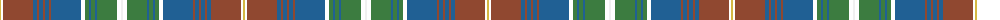

The parent of this is [Daniel Melrose Family Tartan Tartan Number: 7548. Earliest known date: 2008 Daniel Melrose says, "This Tartan is in memory of our ancestors who lived in the Newbigging and Dunsyre area for over 200 years." The tartan was designed to be woven in Ancient colours. (Corrects the 2 yellow stripes error. It should only be one yellow.) See products available Copyright © Blair Urquhart, Comrie, 2015](/tartans/o/2/k2/t30/b4/t2/b4/t2/b4/t2/b30/k4/g4/b2/g4/b2/g20/k4/w/2/)

This was sourced from house-of-tartan.  It is a [18 stripes tartan](/stripes/stripes18/).

Original link http://www.house-of-tartan.scotland.net/house/TartanViewjs.asp?colr=Def&tnam=7548

## Thread count
O/2 K2 T30 B4 T2 B4 T2 B4 T2 B30 K4 G4 B2 G4 B2 G20 K4 W/2

## Palette
Each colour and its ΔE from the base-6 reference it is a variant of.

| Colour | Shade | Base | ΔE (OKLab) |
|---|---|---|---|
| B |  `#206094` | B  | 0.09 |
| DR |  `#981444` | R  | 0.12 |
| G |  `#3C7C40` | G  | 0.10 |
| O |  `#D4B844` | Y  | 0.05 |
| T |  `#904830` | R  | 0.12 |
| W |  `#F0F0F0` | W  | 0.01 |

ID: /variants/o/2/k2/t30/b4/t2/b4/t2/b4/t2/b30/k4/g4/b2/g4/b2/g20/k4/w/2-b206094-dr981444-g3c7c40-od4b844-t904830-wf0f0f0/
