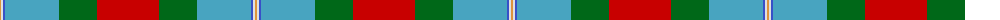

The parent of this is [Glencross, (Solway) (Personal)](/tartans/o/2/ln2/b2/ba54/g38/r/62/)

This was sourced from tartans-authority.  It is a [6 stripes tartan](/stripes/stripes6/).

Original link http://www.tartansauthority.com/tartan-ferret/display/10438/

## Thread count
O/2 LN2 B2 Ba54 G38 R/62

## Palette
Each colour and its ΔE from the base-6 reference it is a variant of.

| Colour | Shade | Base | ΔE (OKLab) |
|---|---|---|---|
| B |  `#3850C8` | B  | 0.12 |
| Ba |  `#48A4C0` | Y  | 0.28 |
| G |  `#006818` | G  | 0.02 |
| LN |  `#E0E0E0` | W  | 0.06 |
| O |  `#DC943C` | Y  | 0.12 |
| R |  `#C80000` | R  | 0.00 |

# Sample pattern

ID: /variants/o/2/ln2/b2/ba54/g38/r/62-b3850c8-ba48a4c0-g006818-lne0e0e0-odc943c-rc80000/
