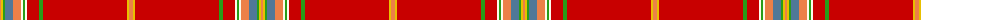

The parent of this is [Kerr of Ardgowan Red (Personal)](/tartans/o/2/y2/g2/b8/o8/w2/g2/w2/r12/g4/r84/y2/o/4/)

This was sourced from tartans-authority.  It is a [13 stripes tartan](/stripes/stripes13/).

Original link http://www.tartansauthority.com/tartan-ferret/display/7322/

## Thread count
O/2 Y2 G2 B8 O8 W2 G2 W2 R12 G4 R84 Y2 O/4

## Palette
Each colour and its ΔE from the base-6 reference it is a variant of.

| Colour | Shade | Base | ΔE (OKLab) |
|---|---|---|---|
| B |  `#507898` | B  | 0.17 |
| G |  `#289C18` | G  | 0.18 |
| O |  `#EC8048` | Y  | 0.17 |
| R |  `#C80000` | R  | 0.00 |
| W |  `#FCFCEC` | W  | 0.03 |
| Y |  `#E8C000` | Y  | 0.00 |

ID: /variants/o/2/y2/g2/b8/o8/w2/g2/w2/r12/g4/r84/y2/o/4-b507898-g289c18-oec8048-rc80000-wfcfcec-ye8c000/
