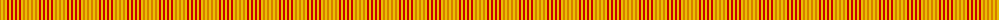

The parent of this is [Compaq](/tartans/o/2/y2/o2/y2/r2/y2/r2/y2/r2/y2/r2/y2/o2/y2/o2/y/2/)

This was sourced from register-of-tartans.  It is a [16 stripes tartan](/stripes/stripes16/).

Original link https://www.tartanregister.gov.uk/tartanDetails.aspx?ref=726

## Thread count
O/2 Y2 O2 Y2 R2 Y2 R2 Y2 R2 Y2 R2 Y2 O2 Y2 O2 Y/2

## Palette
Each colour and its ΔE from the base-6 reference it is a variant of.

| Colour | Shade | Base | ΔE (OKLab) |
|---|---|---|---|
| O |  `#D87C00` | Y  | 0.17 |
| R |  `#C80000` | R  | 0.00 |
| Y |  `#E8C000` | Y  | 0.00 |

ID: /variants/o/2/y2/o2/y2/r2/y2/r2/y2/r2/y2/r2/y2/o2/y2/o2/y/2-od87c00-rc80000-ye8c000/
