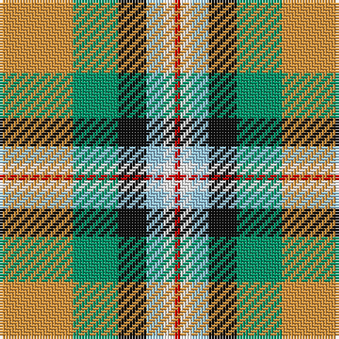

The parent of this is [Ball Htg (Name)](/tartans/o/26/b16/k10/lb6/w4/r/2/)

This was sourced from tartans-authority.  It is a [6 stripes tartan](/stripes/stripes6/).

Original link http://www.tartansauthority.com/tartan-ferret/display/6355/

## Thread count
O/26 B16 K10 LB6 W4 R/2

## Palette
Each colour and its ΔE from the base-6 reference it is a variant of.

| Colour | Shade | Base | ΔE (OKLab) |
|---|---|---|---|
| B |  `#009468` | G  | 0.16 |
| K |  `#101010` | K  | 0.17 |
| LB |  `#98C8E8` | W  | 0.17 |
| O |  `#DC943C` | Y  | 0.12 |
| R |  `#C80000` | R  | 0.00 |
| W |  `#F8F8F8` | W  | 0.01 |

# Sample pattern

ID: /variants/o/26/b16/k10/lb6/w4/r/2-b009468-k101010-lb98c8e8-odc943c-rc80000-wf8f8f8/
