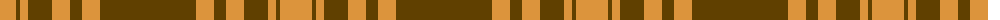

The parent of this is [Yellow Pencil (Corporate)](/tartans/o/32/t4/o8/t24/o18/t12/o18/t/96/)

This was sourced from tartans-authority.  It is a [8 stripes tartan](/stripes/stripes8/).

Original link http://www.tartansauthority.com/tartan-ferret/display/10761/

## Thread count
O/32 T4 O8 T24 O18 T12 O18 T/96

## Palette
Each colour and its ΔE from the base-6 reference it is a variant of.

| Colour | Shade | Base | ΔE (OKLab) |
|---|---|---|---|
| O |  `#DC943C` | Y  | 0.12 |
| T |  `#604000` | G  | 0.14 |

# Sample pattern

ID: /variants/o/32/t4/o8/t24/o18/t12/o18/t/96-odc943c-t604000/
