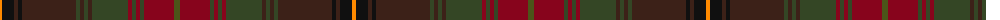

The parent of this is [Strathmore](/tartans/o/4/ka12/k4/ka4/k54/ta4/k4/ta4/k4/ta36/dr4/ta4/dr4/ta4/dr30/t/6/)

This was sourced from register-of-tartans.  It is a [16 stripes tartan](/stripes/stripes16/).

Original link https://www.tartanregister.gov.uk/tartanDetails.aspx?ref=10118

## Thread count
O/4 Ka12 K4 Ka4 K54 Ta4 K4 Ta4 K4 Ta36 DR4 Ta4 DR4 Ta4 DR30 T/6

## Palette
Each colour and its ΔE from the base-6 reference it is a variant of.

| Colour | Shade | Base | ΔE (OKLab) |
|---|---|---|---|
| DR |  `#87041C` | R  | 0.14 |
| K |  `#3C2118` | B  | 0.19 |
| Ka |  `#101010` | K  | 0.17 |
| O |  `#FF8A00` | Y  | 0.13 |
| T |  `#4C5419` | G  | 0.08 |
| Ta |  `#344625` | G  | 0.11 |

ID: /variants/o/4/ka12/k4/ka4/k54/ta4/k4/ta4/k4/ta36/dr4/ta4/dr4/ta4/dr30/t/6-dr87041c-k3c2118-ka101010-off8a00-t4c5419-ta344625/
