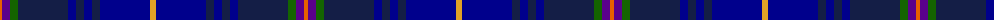

The parent of this is [Blue Peter](/tartans/o/4/p8/g8/dba50/db8/dba8/db8/dba8/db50/y/6/)

This was sourced from register-of-tartans.  It is a [10 stripes tartan](/stripes/stripes10/).

Original link https://www.tartanregister.gov.uk/tartanDetails.aspx?ref=11095

## Thread count
O/4 P8 G8 DBa50 DB8 DBa8 DB8 DBa8 DB50 Y/6

## Palette
Each colour and its ΔE from the base-6 reference it is a variant of.

| Colour | Shade | Base | ΔE (OKLab) |
|---|---|---|---|
| DB |  `#00008C` | B  | 0.13 |
| DBa |  `#141E46` | B  | 0.15 |
| G |  `#146400` | G  | 0.01 |
| O |  `#E86000` | R  | 0.14 |
| P |  `#5A008C` | B  | 0.12 |
| Y |  `#E0A126` | Y  | 0.08 |

ID: /variants/o/4/p8/g8/dba50/db8/dba8/db8/dba8/db50/y/6-db00008c-dba141e46-g146400-oe86000-p5a008c-ye0a126/
