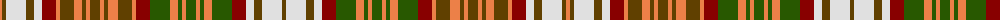

The parent of this is [Strathearn Dress (Fashion?)](/tartans/o/4/t4/ln20/t8/ln8/dr14/o4/t14/o8/t4/o4/t10/o4/t4/o10/t14/o4/dr14/g20/o8/g4/o4/g10/o4/g4/o8/g20/dr14/ln8/t8/ln20/t/4/)

This was sourced from tartans-authority.  It is a [32 stripes tartan](/stripes/stripes32/).

Original link http://www.tartansauthority.com/tartan-ferret/display/8823/

## Thread count
O/4 T4 LN20 T8 LN8 DR14 O4 T14 O8 T4 O4 T10 O4 T4 O10 T14 O4 DR14 G20 O8 G4 O4 G10 O4 G4 O8 G20 DR14 LN8 T8 LN20 T/4

## Palette
Each colour and its ΔE from the base-6 reference it is a variant of.

| Colour | Shade | Base | ΔE (OKLab) |
|---|---|---|---|
| DR |  `#880000` | R  | 0.14 |
| G |  `#285800` | G  | 0.04 |
| LN |  `#E0E0E0` | W  | 0.06 |
| O |  `#EC8048` | Y  | 0.17 |
| T |  `#604000` | G  | 0.14 |

ID: /variants/o/4/t4/ln20/t8/ln8/dr14/o4/t14/o8/t4/o4/t10/o4/t4/o10/t14/o4/dr14/g20/o8/g4/o4/g10/o4/g4/o8/g20/dr14/ln8/t8/ln20/t/4-dr880000-g285800-lne0e0e0-oec8048-t604000/
