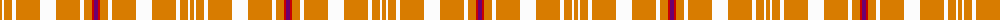

The parent of this is [Gary (Personal)](/tartans/o/4/w2/oa4/oa4/w4/oa24/w16/oa24/w4/oa8/r2/p/4/)

This was sourced from tartans-authority.  It is a [12 stripes tartan](/stripes/stripes12/).

Original link http://www.tartansauthority.com/tartan-ferret/display/564/

## Thread count
O/4 W2 Oa4 Oa4 W4 Oa24 W16 Oa24 W4 Oa8 R2 P/4

## Palette
Each colour and its ΔE from the base-6 reference it is a variant of.

| Colour | Shade | Base | ΔE (OKLab) |
|---|---|---|---|
| O |  `#D87C00` | Y  | 0.17 |
| Oa |  `#D87C00` | Y  | 0.17 |
| P |  `#6C0070` | B  | 0.15 |
| R |  `#C80000` | R  | 0.00 |
| W |  `#FCFCFC` | W  | 0.03 |

ID: /variants/o/4/w2/oa4/oa4/w4/oa24/w16/oa24/w4/oa8/r2/p/4-od87c00-oad87c00-p6c0070-rc80000-wfcfcfc/
