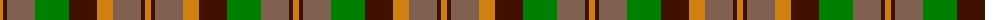

The parent of this is [Monaghan](/tartans/o/6/dr4/lt28/g34/dr28/o16/lt28/dr4/o/6/)

This was sourced from weddslist.  It is a [9 stripes tartan](/stripes/stripes9/).

Original link http://www.weddslist.com/cgi-bin/tartans/pg.pl?source=sts

## Thread count
O/6 DR4 LT28 G34 DR28 O16 LT28 DR4 O/6

## Palette
Each colour and its ΔE from the base-6 reference it is a variant of.

| Colour | Shade | Base | ΔE (OKLab) |
|---|---|---|---|
| DR |  `#401000` | B  | 0.23 |
| G |  `#008000` | G  | 0.09 |
| LT |  `#806050` | R  | 0.17 |
| O |  `#D08010` | Y  | 0.17 |

ID: /variants/o/6/dr4/lt28/g34/dr28/o16/lt28/dr4/o/6-dr401000-g008000-lt806050-od08010/
