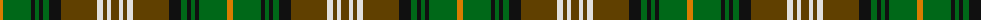

The parent of this is [Dorcas Check Trade Tartan Tartan Number: 1315. Earliest known date: 1980 tba See products available Copyright © Blair Urquhart, Comrie, 2015](/tartans/o/6/g28/k4/g4/k4/g6/k12/t36/ln6/t4/ln4/t/8/)

This was sourced from house-of-tartan.  It is a [12 stripes tartan](/stripes/stripes12/).

Original link http://www.house-of-tartan.scotland.net/house/TartanViewjs.asp?colr=Def&tnam=1315

## Thread count
O/6 G28 K4 G4 K4 G6 K12 T36 LN6 T4 LN4 T/8

## Palette
Each colour and its ΔE from the base-6 reference it is a variant of.

| Colour | Shade | Base | ΔE (OKLab) |
|---|---|---|---|
| G |  `#006818` | G  | 0.02 |
| K |  `#101010` | K  | 0.17 |
| LN |  `#E0E0E0` | W  | 0.06 |
| O |  `#D87C00` | Y  | 0.17 |
| T |  `#604000` | G  | 0.14 |

ID: /variants/o/6/g28/k4/g4/k4/g6/k12/t36/ln6/t4/ln4/t/8-g006818-k101010-lne0e0e0-od87c00-t604000/
