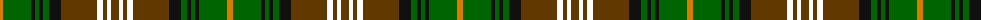

The parent of this is [Dorcas Check](/tartans/o/6/g28/k4/g4/k4/g6/k12/t36/w6/t4/w4/t/8/)

This was sourced from register-of-tartans.  It is a [12 stripes tartan](/stripes/stripes12/).

Original link https://www.tartanregister.gov.uk/tartanDetails.aspx?ref=4815

## Thread count
O/6 G28 K4 G4 K4 G6 K12 T36 W6 T4 W4 T/8

## Palette
Each colour and its ΔE from the base-6 reference it is a variant of.

| Colour | Shade | Base | ΔE (OKLab) |
|---|---|---|---|
| G |  `#006400` | G  | 0.00 |
| K |  `#101010` | K  | 0.17 |
| O |  `#D87C00` | Y  | 0.17 |
| T |  `#603800` | G  | 0.16 |
| W |  `#FFFFFF` | W  | 0.03 |

ID: /variants/o/6/g28/k4/g4/k4/g6/k12/t36/w6/t4/w4/t/8-g006400-k101010-od87c00-t603800-wffffff/
