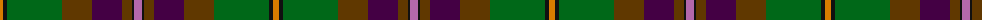

The parent of this is [Aberuchill (Fashion)](/tartans/o/6/k4/g55/t30/dp30/t10/k2/p/8/)

This was sourced from tartans-authority.  It is a [8 stripes tartan](/stripes/stripes8/).

Original link http://www.tartansauthority.com/tartan-ferret/display/6814/

## Thread count
O/6 K4 G55 T30 DP30 T10 K2 P/8

## Palette
Each colour and its ΔE from the base-6 reference it is a variant of.

| Colour | Shade | Base | ΔE (OKLab) |
|---|---|---|---|
| DP |  `#440044` | B  | 0.17 |
| G |  `#006818` | G  | 0.02 |
| K |  `#101010` | K  | 0.17 |
| O |  `#D87C00` | Y  | 0.17 |
| P |  `#B468AC` | R  | 0.21 |
| T |  `#603800` | G  | 0.16 |

# Sample pattern

ID: /variants/o/6/k4/g55/t30/dp30/t10/k2/p/8-dp440044-g006818-k101010-od87c00-pb468ac-t603800/
