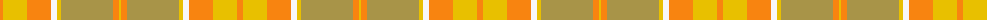

The parent of this is [Desert in Bloom (Fashion)](/tartans/o/6/y24/o24/w6/y4/lt52/o6/y/2/)

This was sourced from tartans-authority.  It is a [8 stripes tartan](/stripes/stripes8/).

Original link http://www.tartansauthority.com/tartan-ferret/display/7054/

## Thread count
O/6 Y24 O24 W6 Y4 LT52 O6 Y/2

## Palette
Each colour and its ΔE from the base-6 reference it is a variant of.

| Colour | Shade | Base | ΔE (OKLab) |
|---|---|---|---|
| LT |  `#A89448` | Y  | 0.17 |
| O |  `#F88410` | Y  | 0.14 |
| W |  `#F8F8F8` | W  | 0.01 |
| Y |  `#E8C000` | Y  | 0.00 |

# Sample pattern

ID: /variants/o/6/y24/o24/w6/y4/lt52/o6/y/2-lta89448-of88410-wf8f8f8-ye8c000/
