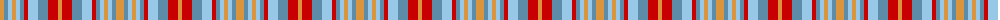

The parent of this is [Unidentified](/tartans/o/8/b4/lb4/o4/lb4/b4/r4/lb10/b10/r10/o/4/)

This was sourced from tartans-authority.  It is a [11 stripes tartan](/stripes/stripes11/).

Original link http://www.tartansauthority.com/tartan-ferret/display/8603/

## Thread count
O/8 B4 LB4 O4 LB4 B4 R4 LB10 B10 R10 O/4

## Palette
Each colour and its ΔE from the base-6 reference it is a variant of.

| Colour | Shade | Base | ΔE (OKLab) |
|---|---|---|---|
| B |  `#5C8CA8` | B  | 0.23 |
| LB |  `#98C8E8` | W  | 0.17 |
| O |  `#DC943C` | Y  | 0.12 |
| R |  `#C80000` | R  | 0.00 |

ID: /variants/o/8/b4/lb4/o4/lb4/b4/r4/lb10/b10/r10/o/4-b5c8ca8-lb98c8e8-odc943c-rc80000/
