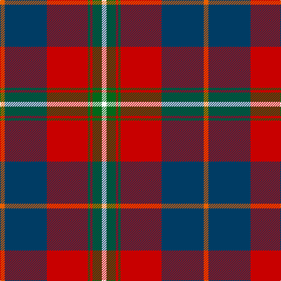

The parent of this is [Cherry, John S. (Personal)](/tartans/o/8/db72/r70/g4/r4/g16/w/8/)

This was sourced from tartans-authority.  It is a [7 stripes tartan](/stripes/stripes7/).

Original link http://www.tartansauthority.com/tartan-ferret/display/10341/

## Thread count
O/8 DB72 R70 G4 R4 G16 W/8

## Palette
Each colour and its ΔE from the base-6 reference it is a variant of.

| Colour | Shade | Base | ΔE (OKLab) |
|---|---|---|---|
| DB |  `#003C64` | B  | 0.07 |
| G |  `#006818` | G  | 0.02 |
| O |  `#E86000` | R  | 0.14 |
| R |  `#C80000` | R  | 0.00 |
| W |  `#FCFCFC` | W  | 0.03 |

# Sample pattern

ID: /variants/o/8/db72/r70/g4/r4/g16/w/8-db003c64-g006818-oe86000-rc80000-wfcfcfc/
