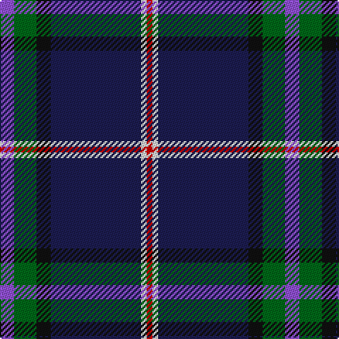

The parent of this is [Marion (Personal)](/tartans/p/10/g16/k10/db64/ln4/r/4/)

This was sourced from tartans-authority.  It is a [6 stripes tartan](/stripes/stripes6/).

Original link http://www.tartansauthority.com/tartan-ferret/display/7374/

## Thread count
P/10 G16 K10 DB64 LN4 R/4

## Palette
Each colour and its ΔE from the base-6 reference it is a variant of.

| Colour | Shade | Base | ΔE (OKLab) |
|---|---|---|---|
| DB |  `#1C1C50` | B  | 0.14 |
| G |  `#006818` | G  | 0.02 |
| K |  `#101010` | K  | 0.17 |
| LN |  `#E0E0E0` | W  | 0.06 |
| P |  `#9050D8` | B  | 0.22 |
| R |  `#C80000` | R  | 0.00 |

# Sample pattern

ID: /variants/p/10/g16/k10/db64/ln4/r/4-db1c1c50-g006818-k101010-lne0e0e0-p9050d8-rc80000/
