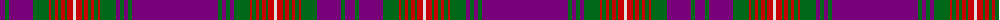

The parent of this is [Arran - 1978 (Fashion)](/tartans/p/10/g4/p24/g16/r2/g4/r3/g3/r4/g2/r6/ln3/r6/g2/r4/g3/r3/g4/r2/g16/pa4/ga4/pa4/ga4/pa/86/)

This was sourced from tartans-authority.  It is a [25 stripes tartan](/stripes/stripes25/).

Original link http://www.tartansauthority.com/tartan-ferret/display/381/

## Thread count
P/10 G4 P24 G16 R2 G4 R3 G3 R4 G2 R6 LN3 R6 G2 R4 G3 R3 G4 R2 G16 Pa4 Ga4 Pa4 Ga4 Pa/86

## Palette
Each colour and its ΔE from the base-6 reference it is a variant of.

| Colour | Shade | Base | ΔE (OKLab) |
|---|---|---|---|
| G |  `#006818` | G  | 0.02 |
| Ga |  `#006818` | G  | 0.02 |
| LN |  `#E0E0E0` | W  | 0.06 |
| P |  `#780078` | B  | 0.16 |
| Pa |  `#780078` | B  | 0.16 |
| R |  `#C80000` | R  | 0.00 |

ID: /variants/p/10/g4/p24/g16/r2/g4/r3/g3/r4/g2/r6/ln3/r6/g2/r4/g3/r3/g4/r2/g16/pa4/ga4/pa4/ga4/pa/86-g006818-ga006818-lne0e0e0-p780078-pa780078-rc80000/
