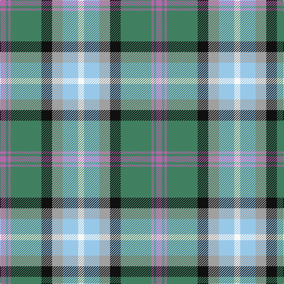

The parent of this is [Alexander of Menstry Htg (Personal)](/tartans/p/10/g4/p4/g52/k18/n18/lb26/w/10/)

This was sourced from tartans-authority.  It is a [8 stripes tartan](/stripes/stripes8/).

Original link http://www.tartansauthority.com/tartan-ferret/display/6715/

## Thread count
P/10 G4 P4 G52 K18 N18 LB26 W/10

## Palette
Each colour and its ΔE from the base-6 reference it is a variant of.

| Colour | Shade | Base | ΔE (OKLab) |
|---|---|---|---|
| G |  `#408060` | G  | 0.13 |
| K |  `#101010` | K  | 0.17 |
| LB |  `#98C8E8` | W  | 0.17 |
| N |  `#A0A0A0` | Y  | 0.20 |
| P |  `#B468AC` | R  | 0.21 |
| W |  `#F8F8F8` | W  | 0.01 |

# Sample pattern

ID: /variants/p/10/g4/p4/g52/k18/n18/lb26/w/10-g408060-k101010-lb98c8e8-na0a0a0-pb468ac-wf8f8f8/
