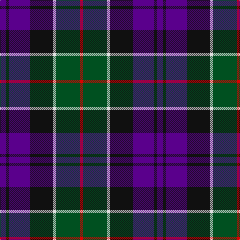

The parent of this is [Colquhoun #3](/tartans/p/12/k6/p42/k46/ln6/g48/r/6/)

This was sourced from register-of-tartans.  It is a [7 stripes tartan](/stripes/stripes7/).

Original link https://www.tartanregister.gov.uk/tartanDetails.aspx?ref=716

## Thread count
P/12 K6 P42 K46 LN6 G48 R/6

## Palette
Each colour and its ΔE from the base-6 reference it is a variant of.

| Colour | Shade | Base | ΔE (OKLab) |
|---|---|---|---|
| G |  `#005020` | G  | 0.08 |
| K |  `#101010` | K  | 0.17 |
| LN |  `#E0E0E0` | W  | 0.06 |
| P |  `#5A008C` | B  | 0.12 |
| R |  `#DC0000` | R  | 0.04 |

# Sample pattern

ID: /variants/p/12/k6/p42/k46/ln6/g48/r/6-g005020-k101010-lne0e0e0-p5a008c-rdc0000/
