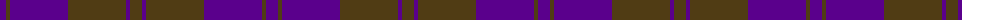

The parent of this is [Harmony 11](/tartans/p/12/t4/p58/t58/p4/t/12/)

This was sourced from register-of-tartans.  It is a [6 stripes tartan](/stripes/stripes6/).

Original link https://www.tartanregister.gov.uk/tartanDetails.aspx?ref=1603

## Thread count
P/12 T4 P58 T58 P4 T/12

## Palette
Each colour and its ΔE from the base-6 reference it is a variant of.

| Colour | Shade | Base | ΔE (OKLab) |
|---|---|---|---|
| P |  `#5A008C` | B  | 0.12 |
| T |  `#503C14` | G  | 0.15 |

# Sample pattern

ID: /variants/p/12/t4/p58/t58/p4/t/12-p5a008c-t503c14/
