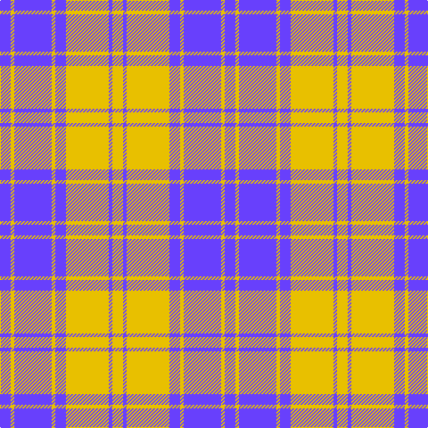

The parent of this is [MacLachlan (Chief's Dress) Blue](/tartans/p/12/y4/p42/y4/p12/y48/p4/y/12/)

This was sourced from register-of-tartans.  It is a [8 stripes tartan](/stripes/stripes8/).

Original link https://www.tartanregister.gov.uk/tartanDetails.aspx?ref=2586

## Thread count
P/12 Y4 P42 Y4 P12 Y48 P4 Y/12

## Palette
Each colour and its ΔE from the base-6 reference it is a variant of.

| Colour | Shade | Base | ΔE (OKLab) |
|---|---|---|---|
| P |  `#6840FC` | B  | 0.21 |
| Y |  `#E8C000` | Y  | 0.00 |

# Sample pattern

ID: /variants/p/12/y4/p42/y4/p12/y48/p4/y/12-p6840fc-ye8c000/
