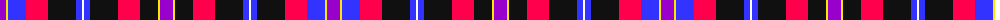

The parent of this is [European Congress of Immunology Corporate Tartan Tartan Number: 10683. Earliest known date: Created to commemorate the 3rd European Congress of Immunology, held in Glasgow in September 2012. The inspiration for this tartan comes from the City of Glasgow tartan, first woven in 1790 by Wilsons of Bannockburn. This modern interpretation incorporates the Congress colours of purple and lime green, and also features the white on blue of the Scottish Saltire. The width of the blue band is 12 threads to mark the year 2012. The colours of the tartan also embrace those of the EFIS (European Federation of Immunological Societies) and the BSI (British Society for Immunology). See products available Copyright © Blair Urquhart, Comrie, 2015](/tartans/p/13/y2/b18/r22/k28/b6/w2/b6/k28/r22/k18/y2/p/13/)

This was sourced from house-of-tartan.  It is a [13 stripes tartan](/stripes/stripes13/).

Original link http://www.house-of-tartan.scotland.net/house/TartanViewjs.asp?colr=Def&tnam=10683

## Thread count
P/13 Y2 B18 R22 K28 B6 W2 B6 K28 R22 K18 Y2 P/13

## Palette
Each colour and its ΔE from the base-6 reference it is a variant of.

| Colour | Shade | Base | ΔE (OKLab) |
|---|---|---|---|
| B |  `#3333FF` | B  | 0.20 |
| K |  `#101010` | K  | 0.17 |
| P |  `#9900CC` | B  | 0.23 |
| R |  `#FF004D` | R  | 0.13 |
| W |  `#FFFFFF` | W  | 0.03 |
| Y |  `#FFE600` | Y  | 0.10 |

ID: /variants/p/13/y2/b18/r22/k28/b6/w2/b6/k28/r22/k18/y2/p/13-b3333ff-k101010-p9900cc-rff004d-wffffff-yffe600/
