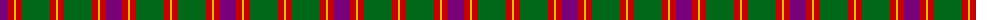
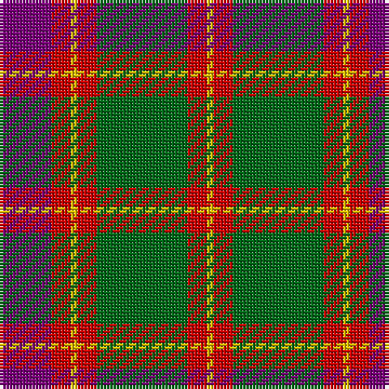

The parent of this is [Logan with Yellow](/tartans/p/16/r6/y2/r6/g28/r6/y/2/)

This was sourced from register-of-tartans.  It is a [7 stripes tartan](/stripes/stripes7/).

Original link https://www.tartanregister.gov.uk/tartanDetails.aspx?ref=2189

## Thread count
P/16 R6 Y2 R6 G28 R6 Y/2

## Palette
Each colour and its ΔE from the base-6 reference it is a variant of.

| Colour | Shade | Base | ΔE (OKLab) |
|---|---|---|---|
| G |  `#006818` | G  | 0.02 |
| P |  `#780078` | B  | 0.16 |
| R |  `#C80000` | R  | 0.00 |
| Y |  `#E8C000` | Y  | 0.00 |

# Sample pattern

ID: /variants/p/16/r6/y2/r6/g28/r6/y/2-g006818-p780078-rc80000-ye8c000/
