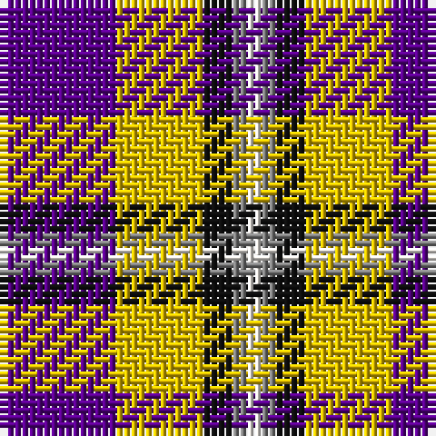

The parent of this is [Ballater Victoria Week](/tartans/p/16/y12/k4/n2/w/2/)

This was sourced from register-of-tartans.  It is a [5 stripes tartan](/stripes/stripes5/).

Original link https://www.tartanregister.gov.uk/tartanDetails.aspx?ref=11064

## Thread count
P/16 Y12 K4 N2 W/2

## Palette
Each colour and its ΔE from the base-6 reference it is a variant of.

| Colour | Shade | Base | ΔE (OKLab) |
|---|---|---|---|
| K |  `#101010` | K  | 0.17 |
| N |  `#808080` | G  | 0.22 |
| P |  `#5A008C` | B  | 0.12 |
| W |  `#F9F5EF` | W  | 0.01 |
| Y |  `#E8C000` | Y  | 0.00 |

# Sample pattern

ID: /variants/p/16/y12/k4/n2/w/2-k101010-n808080-p5a008c-wf9f5ef-ye8c000/
