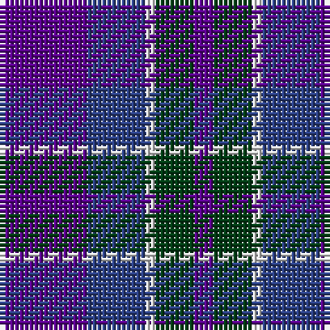

The parent of this is [Cathro](/tartans/p/18/b12/ln2/dg8/p/4/)

This was sourced from register-of-tartans.  It is a [5 stripes tartan](/stripes/stripes5/).

Original link https://www.tartanregister.gov.uk/tartanDetails.aspx?ref=5875

## Thread count
P/18 B12 LN2 DG8 P/4

## Palette
Each colour and its ΔE from the base-6 reference it is a variant of.

| Colour | Shade | Base | ΔE (OKLab) |
|---|---|---|---|
| B |  `#2C4084` | B  | 0.00 |
| DG |  `#003C14` | G  | 0.14 |
| LN |  `#E0E0E0` | W  | 0.06 |
| P |  `#5A008C` | B  | 0.12 |

# Sample pattern

ID: /variants/p/18/b12/ln2/dg8/p/4-b2c4084-dg003c14-lne0e0e0-p5a008c/
