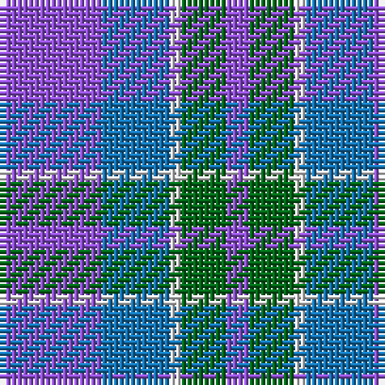

The parent of this is [Cathro (Name)](/tartans/p/18/b12/ln2/g8/p/4/)

This was sourced from tartans-authority.  It is a [5 stripes tartan](/stripes/stripes5/).

Original link http://www.tartansauthority.com/tartan-ferret/display/7354/

## Thread count
P/18 B12 LN2 G8 P/4

## Palette
Each colour and its ΔE from the base-6 reference it is a variant of.

| Colour | Shade | Base | ΔE (OKLab) |
|---|---|---|---|
| B |  `#1474B4` | B  | 0.15 |
| G |  `#006818` | G  | 0.02 |
| LN |  `#E0E0E0` | W  | 0.06 |
| P |  `#9050D8` | B  | 0.22 |

# Sample pattern

ID: /variants/p/18/b12/ln2/g8/p/4-b1474b4-g006818-lne0e0e0-p9050d8/
