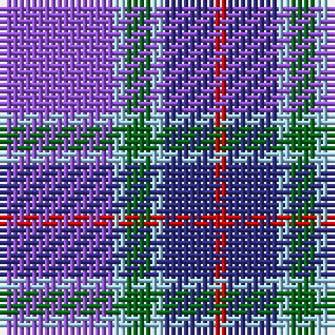

The parent of this is [McIntosh, Georgina (Personal)](/tartans/p/18/lb2/g4/lb2/db8/r/2/)

This was sourced from tartans-authority.  It is a [6 stripes tartan](/stripes/stripes6/).

Original link http://www.tartansauthority.com/tartan-ferret/display/7382/

## Thread count
P/18 LB2 G4 LB2 DB8 R/2

## Palette
Each colour and its ΔE from the base-6 reference it is a variant of.

| Colour | Shade | Base | ΔE (OKLab) |
|---|---|---|---|
| DB |  `#2C2C80` | B  | 0.05 |
| G |  `#006818` | G  | 0.02 |
| LB |  `#98C8E8` | W  | 0.17 |
| P |  `#9050D8` | B  | 0.22 |
| R |  `#C80000` | R  | 0.00 |

# Sample pattern

ID: /variants/p/18/lb2/g4/lb2/db8/r/2-db2c2c80-g006818-lb98c8e8-p9050d8-rc80000/
