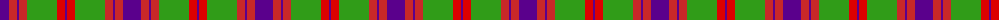
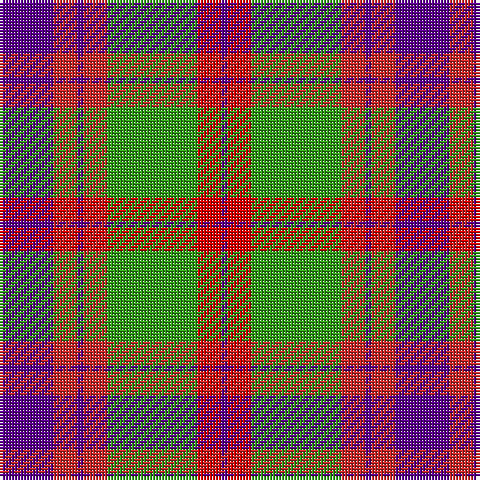

The parent of this is [Logan Light](/tartans/p/18/r8/p2/r8/g30/ra8/p/2/)

This was sourced from register-of-tartans.  It is a [7 stripes tartan](/stripes/stripes7/).

Original link https://www.tartanregister.gov.uk/tartanDetails.aspx?ref=2188

## Thread count
P/18 R8 P2 R8 G30 Ra8 P/2

## Palette
Each colour and its ΔE from the base-6 reference it is a variant of.

| Colour | Shade | Base | ΔE (OKLab) |
|---|---|---|---|
| G |  `#309C18` | G  | 0.18 |
| P |  `#5A008C` | B  | 0.12 |
| R |  `#C82828` | R  | 0.03 |
| Ra |  `#DC0000` | R  | 0.04 |

# Sample pattern

ID: /variants/p/18/r8/p2/r8/g30/ra8/p/2-g309c18-p5a008c-rc82828-radc0000/
