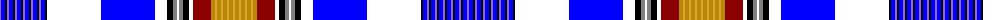

The parent of this is [Am Yisrael Chai](/tartans/p/2/b4/k2/p2/b4/k2/p2/b4/k2/p2/b4/k2/p2/b4/k2/p2/b4/k2/w54/b54/w12/k6/n4/w2/n4/k6/w4/dr18/dy4/y2/dy4/y2/dy4/y2/dy4/y/2/)

This was sourced from register-of-tartans.  It is a [36 stripes tartan](/stripes/stripes36/).

Original link https://www.tartanregister.gov.uk/tartanDetails.aspx?ref=10264

## Thread count
P/2 B4 K2 P2 B4 K2 P2 B4 K2 P2 B4 K2 P2 B4 K2 P2 B4 K2 W54 B54 W12 K6 N4 W2 N4 K6 W4 DR18 DY4 Y2 DY4 Y2 DY4 Y2 DY4 Y/2

## Palette
Each colour and its ΔE from the base-6 reference it is a variant of.

| Colour | Shade | Base | ΔE (OKLab) |
|---|---|---|---|
| B |  `#0000FF` | B  | 0.21 |
| DR |  `#8B0000` | R  | 0.13 |
| DY |  `#B8860B` | Y  | 0.17 |
| K |  `#000000` | K  | 0.00 |
| N |  `#808080` | G  | 0.22 |
| P |  `#9966CC` | B  | 0.23 |
| W |  `#FFFFFF` | W  | 0.03 |
| Y |  `#DAA520` | Y  | 0.08 |

ID: /variants/p/2/b4/k2/p2/b4/k2/p2/b4/k2/p2/b4/k2/p2/b4/k2/p2/b4/k2/w54/b54/w12/k6/n4/w2/n4/k6/w4/dr18/dy4/y2/dy4/y2/dy4/y2/dy4/y/2-b0000ff-dr8b0000-dyb8860b-k000000-n808080-p9966cc-wffffff-ydaa520/
