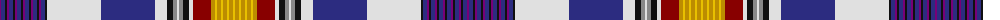

The parent of this is [Am Yisrael Chair (Corporate)](/tartans/p/2/db4/k2/p2/db4/k2/p2/db4/k2/p2/db4/k2/p2/db4/k2/p2/db4/k2/ln54/db54/ln12/k6/n4/ln2/n4/k6/ln4/dr18/dy4/y2/dy4/y2/dy4/y2/dy4/y/2/)

This was sourced from tartans-authority.  It is a [36 stripes tartan](/stripes/stripes36/).

Original link http://www.tartansauthority.com/tartan-ferret/display/10264/

## Thread count
P/2 DB4 K2 P2 DB4 K2 P2 DB4 K2 P2 DB4 K2 P2 DB4 K2 P2 DB4 K2 LN54 DB54 LN12 K6 N4 LN2 N4 K6 LN4 DR18 DY4 Y2 DY4 Y2 DY4 Y2 DY4 Y/2

## Palette
Each colour and its ΔE from the base-6 reference it is a variant of.

| Colour | Shade | Base | ΔE (OKLab) |
|---|---|---|---|
| DB |  `#2C2C80` | B  | 0.05 |
| DR |  `#880000` | R  | 0.14 |
| DY |  `#BC8C00` | Y  | 0.16 |
| K |  `#101010` | K  | 0.17 |
| LN |  `#E0E0E0` | W  | 0.06 |
| N |  `#888888` | R  | 0.24 |
| P |  `#780078` | B  | 0.16 |
| Y |  `#E8C000` | Y  | 0.00 |

ID: /variants/p/2/db4/k2/p2/db4/k2/p2/db4/k2/p2/db4/k2/p2/db4/k2/p2/db4/k2/ln54/db54/ln12/k6/n4/ln2/n4/k6/ln4/dr18/dy4/y2/dy4/y2/dy4/y2/dy4/y/2-db2c2c80-dr880000-dybc8c00-k101010-lne0e0e0-n888888-p780078-ye8c000/
