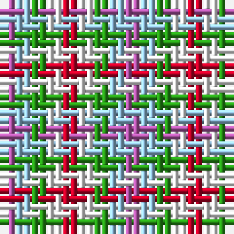

The parent of this is [Daughter of Mull](/tartans/p/2/lb2/g2/w2/r/2/)

This was sourced from register-of-tartans.  It is a [5 stripes tartan](/stripes/stripes5/).

Original link https://www.tartanregister.gov.uk/tartanDetails.aspx?ref=11537

## Thread count
P/2 LB2 G2 W2 R/2

## Palette
Each colour and its ΔE from the base-6 reference it is a variant of.

| Colour | Shade | Base | ΔE (OKLab) |
|---|---|---|---|
| G |  `#289C18` | G  | 0.18 |
| LB |  `#98C8E8` | W  | 0.17 |
| P |  `#B458AC` | R  | 0.20 |
| R |  `#C80028` | R  | 0.02 |
| W |  `#F8F8F8` | W  | 0.01 |

# Sample pattern

ID: /variants/p/2/lb2/g2/w2/r/2-g289c18-lb98c8e8-pb458ac-rc80028-wf8f8f8/
