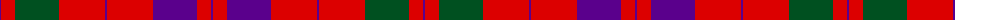

The parent of this is [Lovat or Fraser](/tartans/p/2/r14/g44/r46/p2/r46/p44/r14/p/2/)

This was sourced from register-of-tartans.  It is a [9 stripes tartan](/stripes/stripes9/).

Original link https://www.tartanregister.gov.uk/tartanDetails.aspx?ref=2235

## Thread count
P/2 R14 G44 R46 P2 R46 P44 R14 P/2

## Palette
Each colour and its ΔE from the base-6 reference it is a variant of.

| Colour | Shade | Base | ΔE (OKLab) |
|---|---|---|---|
| G |  `#005020` | G  | 0.08 |
| P |  `#5A008C` | B  | 0.12 |
| R |  `#DC0000` | R  | 0.04 |

ID: /variants/p/2/r14/g44/r46/p2/r46/p44/r14/p/2-g005020-p5a008c-rdc0000/
