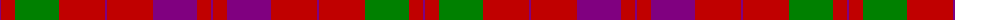

The parent of this is [Lovat, or Fraser](/tartans/p/2/r14/g44/r46/p2/r46/p44/r14/p/2/)

This was sourced from weddslist.  It is a [9 stripes tartan](/stripes/stripes9/).

Original link http://www.weddslist.com/cgi-bin/tartans/pg.pl?source=sts

## Thread count
P/2 R14 G44 R46 P2 R46 P44 R14 P/2

## Palette
Each colour and its ΔE from the base-6 reference it is a variant of.

| Colour | Shade | Base | ΔE (OKLab) |
|---|---|---|---|
| G |  `#008000` | G  | 0.09 |
| P |  `#800080` | B  | 0.17 |
| R |  `#C00000` | R  | 0.02 |

ID: /variants/p/2/r14/g44/r46/p2/r46/p44/r14/p/2-g008000-p800080-rc00000/
