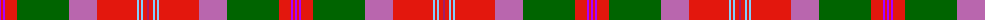

The parent of this is [Scobie (Blackford)](/tartans/p/2/r2/p2/r12/g52/pa28/r40/lb2/r2/lb2/r4/ra/2/)

This was sourced from register-of-tartans.  It is a [12 stripes tartan](/stripes/stripes12/).

Original link https://www.tartanregister.gov.uk/tartanDetails.aspx?ref=10247

## Thread count
P/2 R2 P2 R12 G52 Pa28 R40 LB2 R2 LB2 R4 Ra/2

## Palette
Each colour and its ΔE from the base-6 reference it is a variant of.

| Colour | Shade | Base | ΔE (OKLab) |
|---|---|---|---|
| G |  `#006400` | G  | 0.00 |
| LB |  `#82CFFD` | W  | 0.18 |
| P |  `#AA00FF` | B  | 0.29 |
| Pa |  `#B966AE` | R  | 0.21 |
| R |  `#E3170D` | R  | 0.06 |
| Ra |  `#A01D69` | R  | 0.14 |

ID: /variants/p/2/r2/p2/r12/g52/pa28/r40/lb2/r2/lb2/r4/ra/2-g006400-lb82cffd-paa00ff-pab966ae-re3170d-raa01d69/
