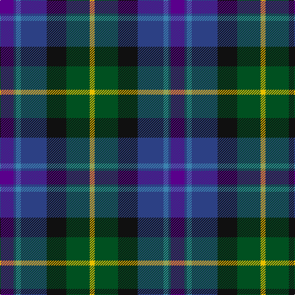

The parent of this is [Ayrshire (International Tartans)](/tartans/p/22/b4/ba8/b42/k32/g38/y/8/)

This was sourced from register-of-tartans.  It is a [7 stripes tartan](/stripes/stripes7/).

Original link https://www.tartanregister.gov.uk/tartanDetails.aspx?ref=152

## Thread count
P/22 B4 Ba8 B42 K32 G38 Y/8

## Palette
Each colour and its ΔE from the base-6 reference it is a variant of.

| Colour | Shade | Base | ΔE (OKLab) |
|---|---|---|---|
| B |  `#2C4084` | B  | 0.00 |
| Ba |  `#3C82AF` | B  | 0.20 |
| G |  `#005020` | G  | 0.08 |
| K |  `#101010` | K  | 0.17 |
| P |  `#5A008C` | B  | 0.12 |
| Y |  `#E8C000` | Y  | 0.00 |

# Sample pattern

ID: /variants/p/22/b4/ba8/b42/k32/g38/y/8-b2c4084-ba3c82af-g005020-k101010-p5a008c-ye8c000/
